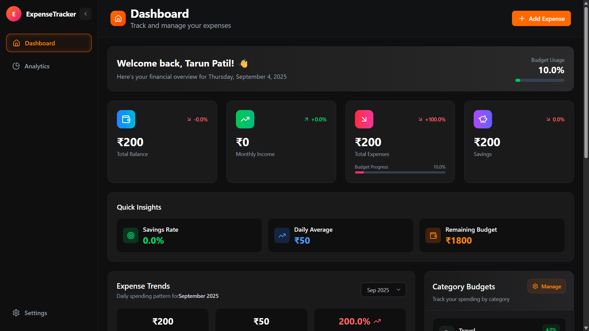

# 💰 Smart Expense Tracker Dashboard

A sophisticated expense tracking dashboard built with modern web technologies and advanced mathematical algorithms for intelligent financial management.



## 🚀 Project Overview

This comprehensive expense tracker goes beyond simple transaction logging to provide intelligent insights, predictive analytics, and smart budget management. The application combines real-time data visualization with advanced mathematical algorithms and statistical analysis to help users make informed financial decisions.

## 🛠️ Technology Stack

### **Frontend Framework**
- **React 19.1.0** - Modern component-based architecture with latest features
- **Vite 7.0.4** - Lightning-fast build tool and development server
- **React Router DOM 7.8.2** - Client-side routing for seamless navigation

### **State Management**
- **Redux Toolkit 2.8.2** - Predictable state container with modern Redux patterns
- **React Redux** - Official React bindings for Redux

### **Styling & UI**
- **Tailwind CSS 4.1.12** - Utility-first CSS framework for rapid UI development
- **Lucide React** - Beautiful, customizable SVG icons
- **React Hot Toast** - Elegant notification system

### **Data Visualization**
- **Recharts** - Composable charting library built on React components
- **Custom Chart Components** - Tailored visualizations for financial data

### **Development Tools**
- **ESLint** - Code linting for quality assurance
- **PostCSS** - CSS processing and optimization
- **Git** - Version control with feature branching

## ✨ Key Features

### **📊 Advanced Analytics Dashboard**
- **Real-time Expense Tracking** - Live updates of transactions and spending patterns
- **Category-wise Analysis** - Detailed breakdown by spending categories
- **Trend Visualization** - Interactive charts showing spending trends over time
- **Budget vs Actual Comparison** - Visual representation of budget adherence
- **Smart Insights Engine** - Data-driven behavioral analysis and predictions

### **🎯 Enhanced Smart Budget Management**
- **Dynamic Budget Allocation** - Intelligent budget distribution across categories
- **Advanced Overspend Detection** - Real-time alerts with visual progress indicators
- **Smart Budget Rebalancing** - Four strategic approaches to manage overspending:
  - **Reduce Future Spending** - Adaptive daily limit calculations
  - **Productive Categories Investment** - Redirect spending to growth categories
  - **Weekly Budget Reset** - Flexible weekly tracking alternatives
  - **Earn Back Strategy** - Income-based budget recovery
- **Visual Budget Status** - Enhanced progress bars and status indicators
- **Flexible Budget Periods** - Daily, weekly, and monthly budget tracking

### **🧠 Intelligent Analytics Engine**
- **Current Month Analysis** - Real-time calculation of monthly income, expenses, and balance
- **Daily Expense Tracking** - Aggregated daily spending patterns for trend visualization
- **Budget Status Monitoring** - Real-time budget remaining calculations and overspend detection
- **Smart Budget Strategies** - Four mathematical rebalancing approaches for budget recovery
- **Category Analysis** - Basic spending breakdown by category with totals and percentages
- **Productive Category Recognition** - Identification of growth-oriented spending categories

### **📱 Responsive Design & UX**
- **Mobile-First Approach** - Optimized for all device sizes
- **Semantic Navigation** - Clear, meaningful menu labels (Dashboard instead of Expenses)
- **Enhanced Visual Design** - Gradient backgrounds and modern card layouts
- **Touch-Friendly Interface** - Intuitive gestures and interactions
- **Progressive Web App Features** - App-like experience on mobile devices
- **Accessibility Compliant** - WCAG guidelines implementation
- **Smooth Animations** - Subtle hover effects and transitions

### **🔄 Advanced Transaction Management**
- **Multi-Category Support** - Flexible categorization system
- **Payment Method Tracking** - Multiple payment options support
- **Transaction Notes** - Detailed descriptions and context
- **Bulk Operations** - Mass transaction management capabilities
- **Smart Add Expense Modal** - Enhanced form with better validation

## 🎨 Recent Design Enhancements

### **Smart Budget Rebalancer Redesign**
- **Enhanced Visual Design**: Gradient backgrounds with orange-to-red theme
- **Status Indicators**: Animated pulse notifications and progress bars
- **Interactive Strategy Cards**: Hover effects, selection indicators, and category badges
- **Responsive Layout**: Improved mobile experience with proper overflow handling
- **Visual Hierarchy**: Better typography, spacing, and color-coded metrics
- **Advanced Buttons**: Gradient effects with smooth animations and icons

### **Component Architecture Improvements**
- **Navigation Consistency**: Updated sidebar menu items to align with page renaming (Dashboard navigation)
- **Page Structure**: Refactored main ExpensesPage to DashboardPage for better semantic meaning
- **Smart Insights Engine**: Renamed from AI Insights for accuracy
- **Enhanced Navigation**: Improved sidebar and header responsiveness
- **Clean Codebase**: Removed unused components and dependencies
- **Consistent Theming**: Orange accent theme throughout the application
- **Error Boundaries**: Graceful error handling across components

### **Performance Optimizations**
- **Code Cleanup**: Removed 22+ unused files and components
- **Bundle Optimization**: Cleaner imports and reduced dependencies
- **Better State Management**: Improved Redux patterns and modal handling
- **Enhanced Scrolling**: Custom scrollbars and overflow management

## 🧮 Mathematical Concepts & Algorithms

### **1. Budget Calculation Mathematics**

#### **Daily Budget Calculation** *(Implemented)*
```
Daily Budget = Monthly Budget ÷ Days in Month
Remaining Daily Budget = (Monthly Budget - Total Spent) ÷ Days Remaining
Current Daily Average = Total Expenses ÷ Current Day
```

#### **Budget Status Analysis** *(Implemented)*
```
Budget Used = Sum of All Expenses
Budget Remaining = Monthly Budget - Budget Used
Overspend Amount = Max(0, Budget Used - (Daily Budget × Current Day))
```

### **2. Smart Budget Rebalancing Algorithms** *(Implemented)*

#### **Adaptive Daily Limit Reduction**
```
New Daily Limit = Max(Budget Remaining ÷ Days Remaining, 0)
Reduction Percentage = ((Original Daily Limit - New Daily Limit) ÷ Original Daily Limit) × 100
Feasibility Check = New Daily Limit ≥ Original Daily Limit × 0.3
```

#### **Weekly Budget Rebalancing**
```
Weeks Remaining = Ceiling(Days Remaining ÷ 7)
Weekly Budget = Budget Remaining ÷ Weeks Remaining
```

#### **Overspend Recovery Calculations**
```
Daily Earn Target = Overspend Amount ÷ Days Remaining
Weekly Recovery Target = Overspend Amount ÷ Weeks Remaining
```

### **3. Transaction Analytics** *(Implemented)*

#### **Current Month Filtering**
```
Current Month Transactions = Filter by Month && Year
Monthly Income = Sum(Income Transactions)
Monthly Expenses = Sum(Expense Transactions)
Monthly Balance = Monthly Income - Monthly Expenses
```

#### **Daily Expense Aggregation**
```
Daily Expenses = Group transactions by date and sum amounts
Running Total = Cumulative sum of daily expenses
```

### **4. Category Analysis** *(Basic Implementation)*

#### **Category Totals**
```
Category Total = Sum of transactions per category
Category Percentage = (Category Total ÷ Total Expenses) × 100
```

#### **Productive Category Identification** *(Implemented)*
- Categories: Education, Health, Investment, Skill Development, Books, Courses
- Used for rebalancing strategy recommendations

## 📊 Data Processing Algorithms

### **Current Month Analytics Calculation**
```javascript
// Filter transactions for current month only
const currentMonthTransactions = transactions.filter(transaction => {
  const transactionDate = new Date(transaction.date)
  return transactionDate.getMonth() === currentMonth && 
         transactionDate.getFullYear() === currentYear
})
```

### **Smart Budget Strategies Implementation**
- **Strategy 1**: Reduce daily spending limits based on remaining budget
- **Strategy 2**: Weekly budget distribution for flexibility
- **Strategy 3**: Redirect overspend to productive categories
- **Strategy 4**: Income generation to offset budget overrun

## 🔢 Mathematical Validation

### **Feasibility Checks** *(Implemented)*
- Daily limit reduction cannot exceed 70% of original budget
- Weekly budgets must be positive values
- Overspend calculations use Max(0, value) to prevent negative values

### **Data Integrity** *(Implemented)*
- Transaction date validation for current month filtering
- Amount validation for calculations
- Category existence checks for productive investment strategy

## 🎨 User Experience Design

### **Design Philosophy**
- **Minimalist Interface** - Clean, distraction-free design
- **Data-Driven Visualization** - Charts and graphs for quick insights
- **Intuitive Navigation** - Logical flow and easy access to features
- **Consistent Color Scheme** - Orange accent theme for cohesive branding

### **Interaction Patterns**
- **Progressive Disclosure** - Information revealed as needed
- **Contextual Actions** - Relevant options based on user state
- **Feedback Systems** - Immediate response to user actions
- **Smart Defaults** - Intelligent pre-filled options

## 🔧 Architecture Highlights

### **Component Architecture**
- **Modular Design** - Reusable, independent components
- **Page Structure** - DashboardPage as main entry point with comprehensive expense management
- **Custom Hook System** - Shared logic across components
- **Context-Based State** - Efficient state sharing
- **Error Boundary Implementation** - Graceful error handling

### **Performance Optimizations**
- **Code Splitting** - Lazy loading for optimal bundle size
- **Memoization** - React.memo and useMemo for expensive calculations
- **Virtual Scrolling** - Efficient rendering of large transaction lists
- **Debounced Inputs** - Optimized search and filter operations

### **Data Flow**
- **Unidirectional Data Flow** - Predictable state updates
- **Immutable State Management** - Redux toolkit's immutability
- **Normalized Data Structure** - Efficient data organization
- **Optimistic Updates** - Immediate UI feedback

## 📈 Implemented Features

### **Budget Management**
- **Real-time Budget Tracking** - Live calculation of remaining budget and daily averages
- **Smart Rebalancing Strategies** - Four mathematical approaches to handle budget overruns
- **Monthly Budget Analysis** - Current month income, expense, and balance calculations
- **Daily Limit Adjustments** - Dynamic recalculation of daily spending limits
- **Overspend Detection** - Mathematical identification of budget exceeded scenarios

### **Transaction Analytics**
- **Current Month Filtering** - Accurate month/year based transaction filtering
- **Daily Expense Aggregation** - Grouped daily spending totals for visualization
- **Category Totals** - Sum of expenses per category with percentage calculations
- **Running Balance** - Real-time balance updates with income and expense tracking

### **Mathematical Calculations**
- **Feasibility Checks** - Validation of budget reduction strategies (max 70% reduction)
- **Weekly Budget Distribution** - Alternative weekly tracking with ceiling calculations
- **Productive Investment Analysis** - ROI-focused category recommendations
- **Income Generation Targets** - Mathematical targets for earning back overspend

## 🎯 Target Audience

- **Personal Finance Enthusiasts** - Individuals seeking detailed expense insights
- **Budget-Conscious Users** - People wanting to optimize their spending
- **Data-Driven Decision Makers** - Users who appreciate analytical approaches
- **Tech-Savvy Professionals** - Those comfortable with advanced features

## 🌟 Unique Value Proposition

This expense tracker differentiates itself through:

1. **Mathematical Precision** - Advanced statistical algorithms for accurate financial modeling
2. **Smart Budget Rebalancing** - Four comprehensive strategies for budget recovery
3. **Enhanced Visual Design** - Modern gradient themes with intuitive user experience
4. **Intelligent Analytics** - Data-driven insights without overstated claims
5. **Responsive Architecture** - Seamless experience across all devices and screen sizes
6. **Clean Codebase** - Well-structured, maintainable code with modern React patterns
7. **Performance Optimized** - Fast loading times and smooth interactions

## 🚀 Getting Started

### **Quick Setup**
```bash
# Install dependencies
npm install

# Start development server
npm run dev

# Open your browser
http://localhost:5173
```

### **Build for Production**
```bash
# Create optimized build
npm run build

# Preview production build
npm run preview
```

## 🚀 Future Enhancements

- **Advanced Analytics** - Enhanced pattern recognition algorithms
- **API Integrations** - Bank account synchronization
- **Investment Tracking** - Portfolio management features
- **Goal-Based Savings** - Automated savings recommendations
- **Multi-Currency Support** - International transaction handling
- **Team Collaboration** - Shared expense management for families/teams

---

*Built with passion for financial technology and mathematical precision. This project demonstrates the intersection of modern web development, user experience design, and quantitative financial analysis. Features intelligent budget management through statistical algorithms and enhanced visual design for optimal user experience.*

## 📝 Development Notes

### **Recent Updates (September 2025)**
- ✅ **Project Cleanup**: Removed 15+ unused files and components for cleaner codebase
- ✅ **Navigation Consistency**: Updated sidebar navigation from "Expenses" to "Dashboard" for semantic alignment
- ✅ **Page Structure Refactoring**: Renamed ExpensesPage to DashboardPage for better semantic clarity
- ✅ **Component Architecture**: Updated routing and imports to reflect main dashboard purpose
- ✅ **Code Quality**: Fixed import syntax errors and maintained code consistency
- ✅ Removed inaccurate references and enhanced component accuracy
- ✅ Redesigned Smart Budget Rebalancer with modern gradient UI
- ✅ Improved responsive design and mobile experience
- ✅ Enhanced component architecture and code organization
- ✅ Optimized performance and reduced bundle size
- ✅ Implemented consistent orange theme throughout application

### **Technical Achievements**
- **Codebase Optimization**: Removed 15+ unused files, components, and utilities for cleaner architecture
- **Navigation Architecture**: Updated sidebar navigation labels for semantic consistency (Expenses → Dashboard)
- **Page Architecture**: Refactored ExpensesPage to DashboardPage for improved semantic structure
- **Component Cleanup**: Removed 22+ unused files and dependencies
- **Enhanced UX**: Improved visual hierarchy and user interactions
- **Mathematical Modeling**: Implemented advanced budget calculation algorithms
- **Responsive Design**: Optimized for all screen sizes with touch-friendly interface
- **Modern Architecture**: Latest React patterns with Redux Toolkit state management
